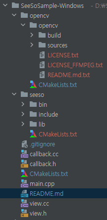

<p align="center">
    
</p>
<div align="center">
    <h1>SeeSo Windows Sample</h1>
    <a href="https://github.com/visualcamp/seeso-sample-android/releases" alt="release">
        
    </a>
</div>

## SeeSo
SeeSo is an AI based eye tracking SDK which uses image from RGB camera to track where the user is looking.
Extra hardware is not required and you can start your development for free.
In 2021, SeeSo was recognized for its innovative technology and won GLOMO Award for Best Mobile Innovation for Connected Living!
1. Supports multi-platform (iOS/Android/Unity/Windows/Web-JS)
2. Has simple and quick calibration (1-5 points)
3. Has high accuracy and robustness compared to its competitors.

## Documentation
* Overview: https://docs.seeso.io/docs/seeso-sdk-overview/
* Quick Start: https://docs.seeso.io/docs/windows-quick-start/
* API: https://docs.seeso.io/docs/windows-api-docs/

## Requirements
* Windows
* C++14
* [CMake](https://cmake.org/download/) >= 3.5
* [OpenCV](https://opencv.org/releases/)
* [SeeSo Windows SDK](https://console.seeso.io/)
* Must be issued a license key in [SeeSo Console](https://console.seeso.io/)

## Setting License Key
* Get a license key from https://console.seeso.io and copy your key to [`main.cpp`](main.cpp)
   ```
   // authenticate
   const char* license_key = "PUT YOUR LICENSE KEY HERE";
   ```

## How to run
1. Clone or download this project.
2. Copy the extracted `seeso` folder to this project.
3. Download OpenCV windows library from https://opencv.org/releases/
4. Copy the extracted `opencv` into this project's [`opencv` directory](opencv/)  
    By now, the project structure should be like below  
    
5. Build the project with CMake
    * You can load a CMake project with IDEs, such as CLion or Visual Studio
    * Or you can build with command line  
    ```
    cmake -B build -DCMAKE_BUILD_TYPE=Release
    cmake --build build --config Release
    ```
    * vcpkg is not supported yet. If you want to build with Visual Studio project instead of CMake,
      you have to manually implement the source codes and third party libraries.
      
## Contact Us
If you have any problems, feel free to [contact us](https://seeso.io/Contact-Us) 
